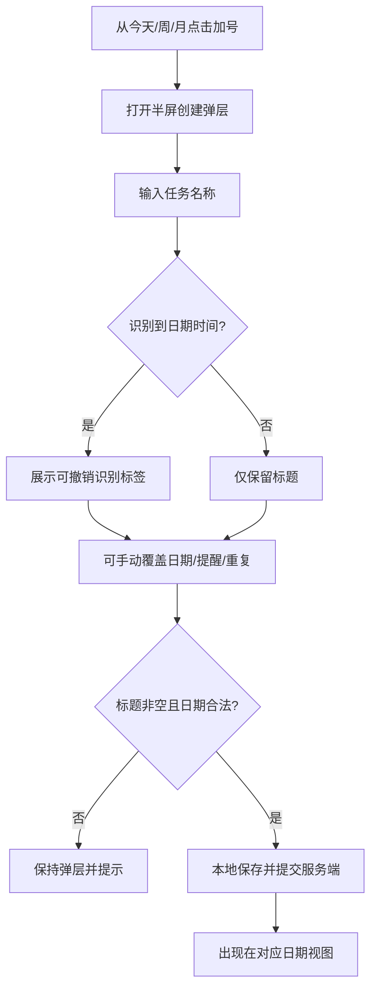
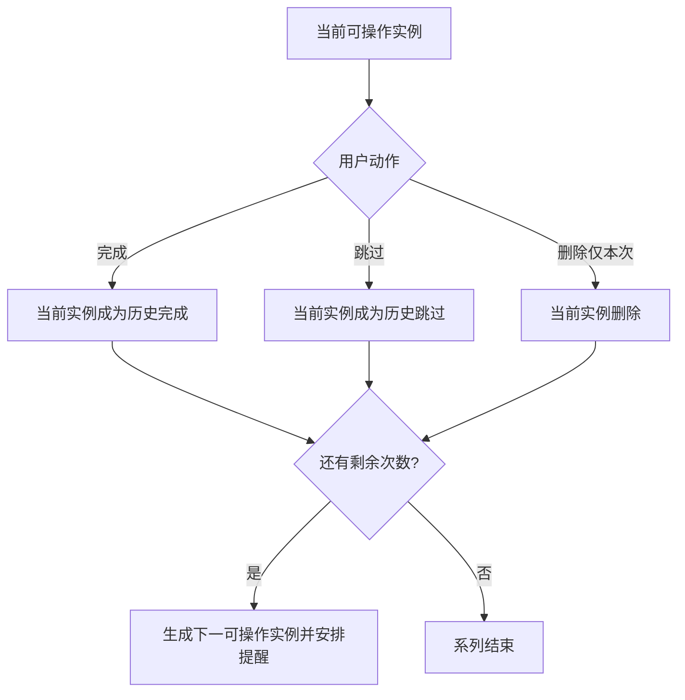
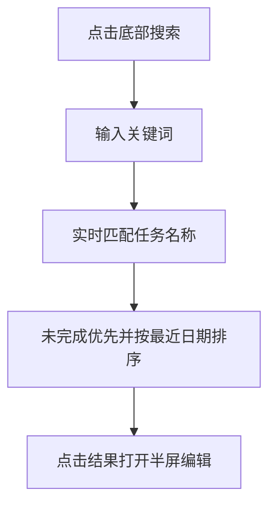

# 产品需求文档（PRD）：个人 TickTick APK v1

<!-- 初稿日期: 2026-10-02 ｜ 相关: problem-definition.md · persona.md · scenarios.md · interaction.md -->

## 执行摘要

- **一句话**：一款供唯一使用者长期使用、复刻指定滴答清单深色界面的联网 Android 任务应用。
- **30 秒**：应用提供今天/已过期、七日大格子周视图、截图式月视图、半屏创建/编辑、中文日期识别、无时间与跨天任务、重复任务、准点提醒和标题模糊搜索。数据联网存储，无登录和账号体系。

## 产品目标

1. 在荣耀 200 上完成个人任务从创建到完成、恢复、删除的完整闭环。
2. 目标页面在 1200×2664 基准下与两张参考截图保持高度视觉一致。
3. 任务的显示、逾期、重复推进和跨天行为无歧义。
4. 网络短暂不可用时不丢失用户操作。

## 必须有

- **REQ-01**：展示“已过期”和“今天”任务，并正确区分未完成、完成和逾期样式。
- **REQ-02**：提供七天铺满一屏的周视图和截图式月视图。
- **REQ-03**：通过半屏弹层创建、编辑和删除任务。
- **REQ-04**：支持自然语言识别日期时间，并允许取消或手动覆盖。
- **REQ-05**：支持无日期时间细分：单日无时间、单日定时和跨天全天范围。
- **REQ-06**：支持提醒并展示提醒当前是否可准点工作。
- **REQ-07**：支持每天、工作日、每周指定星期、每月指定日期和指定次数重复。
- **REQ-08**：支持完成、恢复、跳过、删除单次和删除本次及以后。
- **REQ-09**：支持任务名称模糊搜索与拼音首字母匹配。
- **REQ-10**：任务数据联网保存；断网修改可见且网络恢复后自动同步。
- **REQ-11**：底部「收集箱」存放未排期任务；已排期任务可移入，移入后不再出现在任务页和日历页。

## 明确不做

- 登录、注册、账号和跨设备同步。
- 任务详情独立页面、备注、附件、子任务。
- 优先级、标签、清单分类、协作。
- 习惯、番茄、第三方日历、时间轴周视图。
- 搜索错别字纠正和全文内容搜索。

## 产品流程

### 创建与保存

### 完成与重复推进

### 搜索

## 生命周期与显示规则

### 单日任务

| 状态 | 显示规则 |
|---|---|
| 无日期 | 进入底部「收集箱」；不进入今天、周、月或已过期；可以通过搜索找到。已排期任务可移入收集箱，移入后清除日期、时间和重复，并从任务/日历页消失 |
| 单日无时间 | 目标日期全天显示，不自动提醒 |
| 单日定时 | 目标日期显示 `HH:mm`，可设置提醒 |
| 当天完成 | 留在当天视图底部并置灰 |
| 次日仍未完成 | 进入已过期；当天具体时间经过不提前过期 |

### 跨天任务

- 开始日至结束日每天显示，但所有卡片指向同一个任务。
- 任意一天完成，整个任务完成，覆盖日期内卡片同步置灰。
- 结束日结束仍未完成，次日进入已过期。
- 日期范围修改后，旧日期立即移除，新日期立即显示。

### 已过期

- 顶部标签显示未完成数量。
- 按原计划日期倒序分组，最近过期日期在前。
- 未完成卡片保持高亮，仅原日期/时间使用低饱和红色。
- 完成后移出；改期后移动到相应日期；删除后消失并短暂提供撤销。
- 无日期任务永不过期。

### 重复任务

- 类型：每天、工作日、每周指定星期、每月指定日期。
- 可设置指定次数；次数包含首次，跳过当前周期消耗一次。
- 每月 29/30/31 在目标月不存在时落到当月最后一天。
- 始终只有当前实例可操作；未来周期可在日历中只读预览。
- 完成、跳过或删除当前实例后，若仍有次数才生成下一实例。
- 编辑提供“仅本次”“本次及以后”；删除提供相同范围，历史完成/跳过记录保留。
- 撤销完成时，仅当新生成的下一实例尚未被编辑或处理，才撤回下一实例并恢复当前实例。

## 周与月视图

- 周视图七个日期格固定铺满顶栏以下空间，无纵向滚动。
- 周一至周六为两列三行；周日横跨底部整行。
- 左右滑动或点击箭头切换周；点击日期格查看该日完整任务；长按空白创建对应日期任务。
- 格内空间不足时显示前若干条和“还有 N 项”。
- 月视图：左上紧凑月历，其余为两列日期任务卡；可上下浏览月份、点日期定位、显示/隐藏已完成。

## 搜索规则

- 搜索范围包括未完成、完成、已过期、未来和无日期任务。
- 支持中文连续/非连续字符、英文大小写忽略、拼音全拼和拼音首字母。
- 不做错别字纠正。
- 未完成结果优先，其后按与今天的日期距离排序；同组最近编辑优先。
- 空输入显示最近编辑任务；结果点击打开半屏编辑。

## 网络与失败的产品行为

| 情况 | 产品结果 |
|---|---|
| 网络不可用 | 本地操作立即生效，并显示“等待同步” |
| 恢复网络 | 自动提交待同步操作并刷新 |
| 服务端拒绝或长期失败 | 保留本地修改，显示“同步失败，点按重试” |
| 通知权限关闭 | 任务仍保存，提醒显示“不可用” |
| 精确闹钟不可用 | 任务仍保存，提醒显示“可能延迟” |
| 日期解析歧义 | 不自动采用低置信结果，交给手动日期选择 |

## 给界面的约束

- 深色背景、蓝色主强调、圆角深灰任务卡和蓝色悬浮加号与参考截图一致。
- 未完成保持高亮；已完成置灰；逾期只标红日期/时间，不把整个卡片置灰。
- 创建与编辑使用半屏底部弹层，不进入独立任务详情页。
- 底部导航保留任务、日历、搜索以及截图中的第四入口外观；第四入口本期不可操作。

## 成功指标

- 所有 Must Have 行为存在自动化验收；像素级视觉、MagicOS 真机提醒作为人工验收残留。
- 创建普通任务在三个主要操作内完成：点击加号、输入、保存。
- 所有生命周期转换后，今天、已过期、周、月和搜索结果保持一致。

## 拍板

- 周视图仅做七日大格子，不做时间轴。
- 无时间任务不自动提醒。
- 跨天任务在结束日结束后才过期。
- 今日完成项当天置灰沉底。
- 搜索加入拼音首字母，不加入错别字纠正。
- 无登录、无 App 密钥配置。

